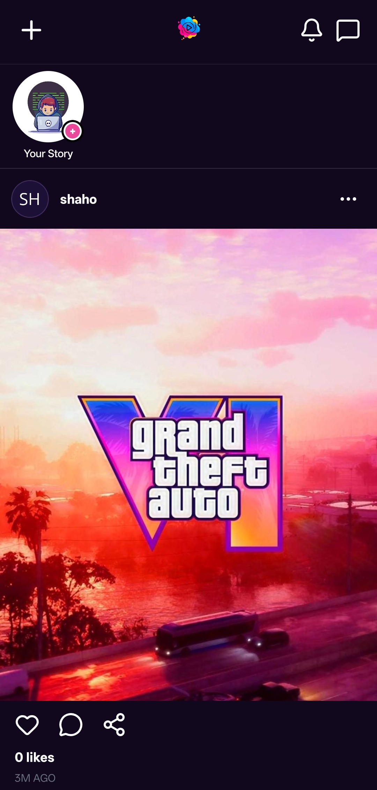
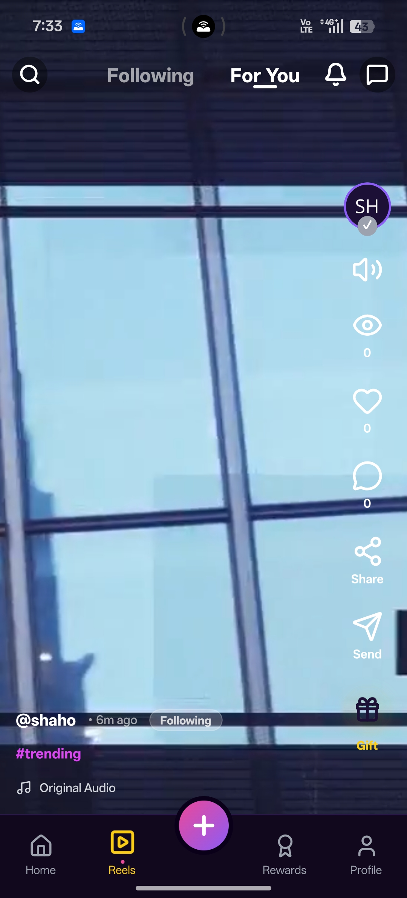
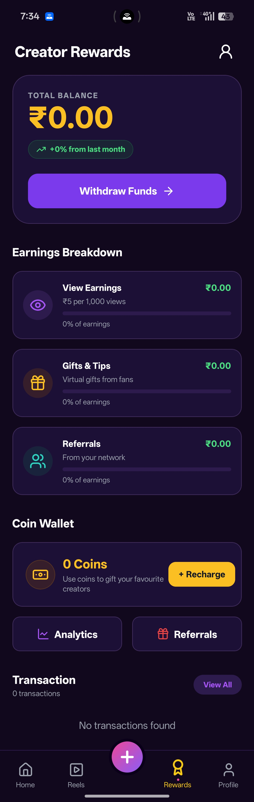
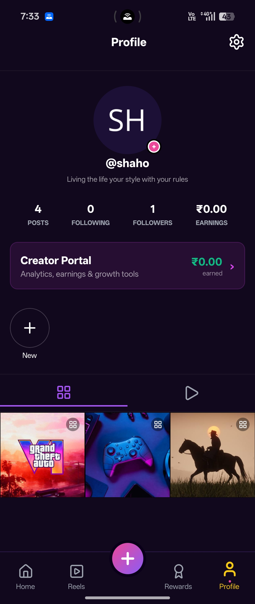
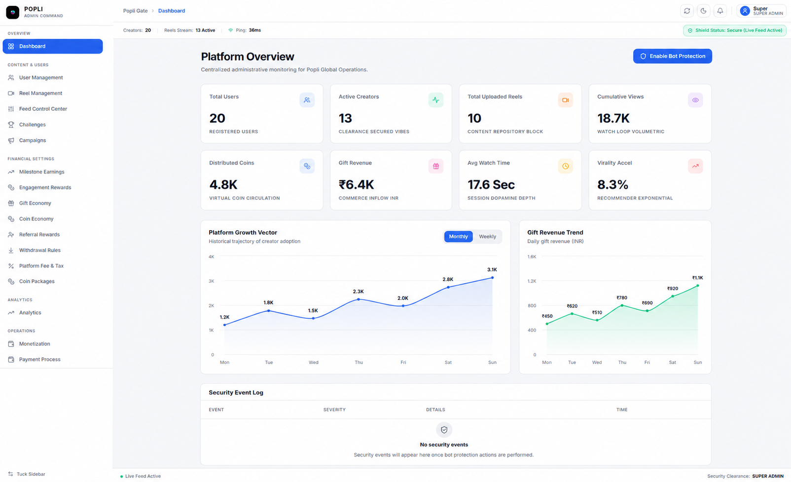

# Popli - Short Video Social Media Platform

> **Create. Connect. Earn.**

Popli is a short-form video social media platform built for the Indian market, enabling users to create, discover, and share engaging short videos while providing creators with an integrated monetization ecosystem. The platform combines social networking, virtual gifting, creator earnings, referrals, KYC verification, and secure withdrawals into a single experience.

---

## Download the App

Visit the Popli website to access the application:

**https://popli-app.vercel.app**

> Visit the website to get started with Popli and experience the platform on your device.

---

## Platform Components

| Component            | Description                                                                                                   |
| -------------------- | ------------------------------------------------------------------------------------------------------------- |
| **Mobile App**       | Social platform for creating, watching, sharing, and engaging with short-form videos                          |
| **Creator Platform** | Enables creators to earn through views, virtual gifts, and referrals                                          |
| **Admin Panel**      | Web-based panel for managing users, content, challenges, campaigns, and platform operations                   |
| **Backend API**      | Backend services powering authentication, social features, monetization, wallets, referrals, KYC, and payouts |

---

## Features

### Short-Form Video

* Scrollable short-video feed for content discovery
* Upload videos directly from the device gallery
* Capture photos and videos within the application
* Music synchronization for reels
* Location tagging
* People tagging
* Video views and engagement tracking
* Creator profiles with content and analytics

### Social Engagement

* Like and interact with short videos
* Comment on videos
* Like comments
* Reply to comments with threaded conversations
* User profiles and creator content
* Real-time user-to-user chat and messaging
* Notifications for relevant user activity

### Creator Monetization

* View-based creator earnings
* Milestone-based earning system
* Creators earn ₹1 for every 200 eligible views
* Virtual gifting system for supporting creators
* Multiple virtual gift types with different coin values
* 60/40 revenue split for virtual gifts
* Creator wallet for tracking earnings
* Separate tracking for view, gift, and referral earnings
* Pending and withdrawable balance management

### Virtual Coin & Gift System

* Users can purchase virtual coins
* Coins can be used to send virtual gifts to creators
* Multiple gift definitions with different values
* Gift transactions recorded against creator accounts
* Creator earnings generated from received gifts
* Platform and creator revenue split automatically calculated

### Creator Wallet & Withdrawals

* Centralised creator earnings wallet
* View earnings tracking
* Gift earnings tracking
* Referral earnings tracking
* Pending balance management
* Withdrawable balance management
* Withdrawal request system
* Withdrawal fee handling
* Secure creator payouts through RazorpayX

### KYC & Verification

* PAN and Aadhaar based KYC verification
* KYC status tracking
* Duplicate verification prevention
* KYC validation before eligible financial withdrawals
* Verification-based activation of certain reward benefits

### Referral System

* Unique referral code for every user
* Referral-based user acquisition
* Referrer receives **100 coins**
* Referred user receives **25 coins**
* Referral rewards initially remain pending
* Rewards become eligible after required conditions are completed
* KYC and reel upload requirements for referral reward activation
* Automatic reward crediting after eligibility conditions are fulfilled

### Financial Transaction System

* Transaction ledger for financial activities
* Coin purchase transaction tracking
* Virtual gift transaction tracking
* Creator earning records
* Referral reward records
* Pending-to-withdrawable balance promotion
* Transaction consistency and atomic financial operations
* Withdrawal transaction tracking
* Razorpay integration for coin purchases
* RazorpayX integration for creator bank payouts

### Challenges & Campaigns

* Platform challenges for creators and users
* Campaign creation and management
* Challenge approval and rejection workflow
* Campaign-based content engagement
* Administrative control over active campaigns

### Admin Panel

* User management
* Content management
* Creator management
* Challenge and campaign management
* Notification management
* Transaction monitoring
* Wallet and earnings management
* KYC-related administration
* Platform activity monitoring

### Notifications

* User activity notifications
* Engagement notifications
* Creator-related notifications
* Referral reward notifications
* Wallet and transaction notifications
* Platform and campaign notifications

---

## Tech Stack

| Layer            | Technology                 |
| ---------------- | -------------------------- |
| Mobile App       | React Native, Expo         |
| State Management | Zustand                    |
| Backend          | NestJS, Node.js            |
| ORM              | Prisma                     |
| Database         | PostgreSQL                 |
| Authentication   | JWT                        |
| Object Storage   | Cloudflare R2              |
| Video Streaming  | Cloudflare Stream          |
| Coin Payments    | Razorpay                   |
| Creator Payouts  | RazorpayX                  |
| KYC              | PAN & Aadhaar Verification |

---

## Database

* PostgreSQL database with Prisma ORM
* Structured data models for users, videos, comments, likes, chats, wallets, transactions, gifts, referrals, KYC, withdrawals, challenges, and notifications
* Financial transactions tracked through dedicated ledger records
* Foreign key relationships and database constraints for data integrity
* Transactional operations used for critical wallet and reward updates
* Creator earnings maintained separately by earning source
* Referral rewards tracked through pending and completed states

---

## Monetization Model

Popli follows a creator-first monetization model:

**Users Purchase Coins**
↓
**Coins Used to Send Virtual Gifts**
↓
**Creators Receive Gift Earnings**
↓
**60% Creator Share / 40% Platform Share**
↓
**Earnings Added to Creator Wallet**
↓
**KYC Verification**
↓
**Withdrawal to Bank Account**

Creators can also earn through **video views** and **referral rewards**, creating multiple earning opportunities within the platform.

---

## Screenshots

### Mobile App

  &nbsp;
  &nbsp;
  &nbsp;
  

### Admin Panel

  

---

## Author

**Shahiduddin (Shaho)**

Email: [shahiduddin153@gmail.com](mailto:shahiduddin153@gmail.com)

---

*Built during internship at Zenvora Infotech*
